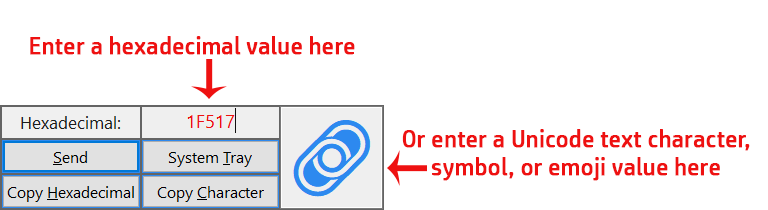
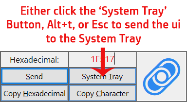
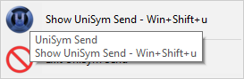

# UniSym Send

 
 
 
 

Unicode character, symbol, and emoji utility for Windows written in ***AutoHotkey***

## Sections

[Features](#features) 
[Usage](#usage) 
[Motivation](#motivation) 
[Project/Downloads](#downloads) 
[Future Updates](#updates) 
[Preview Video](#video) 
[License](#license)

## Features 

- Send Unicode symbols.
- Copy hexadcimal values or unicode symbols to the clipboard.
- Cross-reference hexadcimal values or unicode symbols.

## Usage 

### This program is a portable executable that runs in the System Tray. 

- Run the program and it will bring up the display:

- Enter either a hexadcimal value or the Unicode symbol in the corresponding control:

- To send the ui to the System Tray send hotkeys or a button:

  - Hotkeys
    - Esc
    - Alt+t
  - Button
    - System Tray

- To show the window either right click on the 'UniSym Send' icon in the System Tray and click 'Show UniSym Send' or use a hotkey:

  - Hotkey
    - Win+Shift+u

## Motivation 

I work and play with Unicode a lot and wanted a easy way to do so.

There is another tool like this (also written in AutoHotkey) and it works just fine, but all it can do is send.

## Project/Downloads 

### This program can be ran in 2 ways:

- Compiled executable - portable/single file, no dependencies.

- Source files - requires AutoHotkey to be installed.

### Downloads

- Direct Downloads - Compiled Executables
  - [UniSym Send X86](https://github.com/Lateralus138/UniSym-Send/releases/download/1.5.4.20/UniSymSend_x86.exe)
  - [UniSym Send X64](https://github.com/Lateralus138/UniSym-Send/releases/download/1.5.4.20/UniSymSend_x64.exe)
  - [Source Files](https://github.com/Lateralus138/UniSym-Send/archive/1.5.4.20.zip)
- Release Pages
  - [GitHub Release](https://github.com/Lateralus138/UniSym-Send/releases/)
  - [GitHub Repository](https://github.com/Lateralus138/UniSym-Send/)

### Future Updates 

I have plans for at least 1 update with a new feature and I'm planning a 2nd version written in Python.

  - V1 - Update - AutoHotkey
    - New feature
      - Adding an ComboBox/UpDown control to scroll through values.
  - V2 - Re-Write - Python

### Preview Video On YouTube 

[Preview](https://youtu.be/aG6kG4aaI9Q)

### [License File](LICENSE) 

>This program is free software: you can redistribute it and/or modify it under the terms of the GNU General Public License as published by the Free Software Foundation, either version 3 of the License, or (at your option) any later version.

>This program is distributed in the hope that it will be useful, but WITHOUT ANY WARRANTY; without even the implied warranty of MERCHANTABILITY or FITNESS FOR A PARTICULAR PURPOSE.  See the GNU General Public License for more details.

